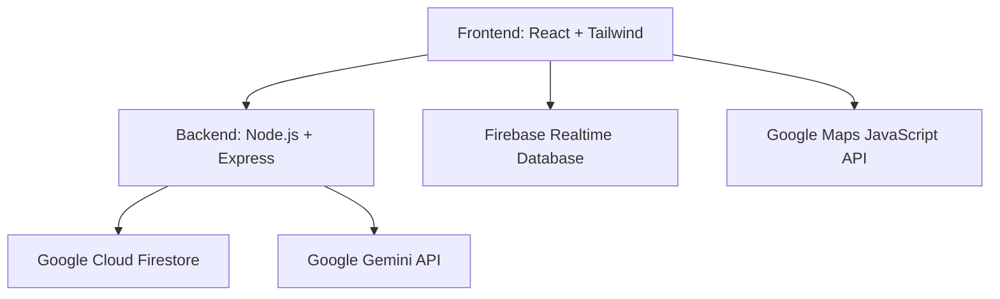

# VenueFlow — Smart Stadium Experience Platform

VenueFlow is an AI-powered smart stadium experience platform designed to improve the physical event experience for attendees at large-scale sporting venues through real-time crowd heatmaps, smart queue estimates, a venue chatbot, and a staff coordination feed.

## Problem Statement
Large-scale venues often face crowd movement hotspots, long waiting times for queues, and a lack of real-time coordination between staff and attendees. VenueFlow addresses these issues by offering a responsive web app to give attendees a real-time smart companion and staff an operations dashboard.

## Architecture


## Google Services Used
- **Google Gemini API (gemini-2.0-flash)**: Used for the AI chatbot answering attendee queries, generating natural language crowd summaries, and creating personalized itineraries.
- **Google Maps JavaScript API**: Overlays colored crowd density markers on a stadium map.
- **Firebase Firestore**: Stores and retrieves crowdsourced wait time estimates and crowd density.
- **Firebase Realtime Database**: Synchronizes real-time staff broadcast messages to attendees.
- **Google Cloud Run**: Containerized backend API deployment.
- **Google Cloud Secret Manager**: Securely stores API keys and production credentials.

## Prerequisites
- Node.js v18+
- Google Cloud Project with Cloud Run enabled
- Firebase Project configured
- Gemini API Key

## Local Setup
1. Clone the repository.
2. Install dependencies for both frontend and backend:
   ```bash
   cd frontend && npm install
   cd ../backend && npm install
   ```
3. Copy `.env.example` to `.env` in the root directory or inside the respective folders, and fill in the values:
   ```bash
   cp .env.example .env
   ```
4. Start both dev servers:
   ```bash
   # Backend
   cd backend && npm run dev
   # Frontend
   cd frontend && npm run dev
   ```

## Cloud Run Deployment
Use the included `cloudbuild.yaml` file:
```bash
gcloud builds submit --config cloudbuild.yaml
```

## Testing
```bash
# Run tests
npm test
# Run test coverage
npm run test:coverage
```

## Security
- **API Keys**: Managed via Google Cloud Secret Manager in production. Never hardcode keys.
- **Data Entry**: Use `.env` file for local, which is git-ignored.
- **Secret Manager Setup**:
  ```bash
  gcloud secrets create GEMINI_API_KEY --replication-policy="automatic"
  echo -n "YOUR_KEY_HERE" | gcloud secrets versions add GEMINI_API_KEY --data-file=-
  ```
