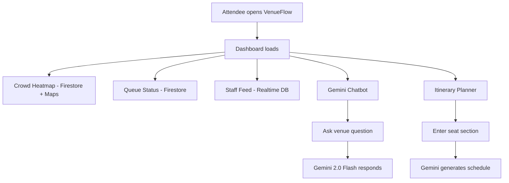

# VenueFlow — Smart Stadium Experience Platform

VenueFlow is an AI-powered smart stadium experience platform designed to improve the physical event experience for attendees at large-scale sporting venues through real-time crowd heatmaps, smart queue estimates, a Gemini-powered venue chatbot, and a staff coordination feed.

## Chosen Vertical

**Physical Event Experience** — Smart stadium assistant with crowd navigation, queue prediction, and real-time coordination.

## Problem → Feature Alignment

| Problem Area | Feature | Google Service Used |
|-------------|---------|--------------------|
| **Crowd Movement** | Live Crowd Heatmap | Firebase Firestore + Google Maps API |
| **Waiting Times** | Smart Queue Estimator | Firebase Firestore (real-time wait times) |
| **Real-Time Coordination** | Staff Broadcast Feed | Firebase Realtime Database |
| **Attendee Guidance** | Gemini AI Chatbot | Gemini API (gemini-2.0-flash) |
| **Personalization** | Event Itinerary Generator | Gemini API (gemini-2.0-flash) |

## Approach and Logic

1. **Crowd data** is stored in Firestore and served with a 30-second server-side cache to reduce costs while staying fresh.
2. **Queue wait times** are crowdsourced and stored per-location in Firestore, giving attendees accurate estimates.
3. **Gemini AI** serves 3 distinct roles: (a) answering natural language venue queries, (b) generating crowd summaries, (c) creating personalized event itineraries based on seat section.
4. **Staff broadcasts** are pushed to Firebase Realtime Database and streamed live to all connected attendees.
5. **Google Maps** overlays color-coded density markers on a stadium map so attendees can visually navigate away from crowds.

## How the Solution Works



## Google Services Integration

- **Gemini API (gemini-2.0-flash)**: Powers 3 distinct AI features — chatbot, crowd summary, and itinerary generation
- **Google Maps JavaScript API**: Renders stadium map with real-time crowd density overlays
- **Firebase Firestore**: Stores crowd density per section and queue wait times
- **Firebase Realtime Database**: Streams live staff announcements to attendees
- **Google Cloud Run**: Hosts the containerized Node.js backend with auto-scaling

## Accessibility

Built to **WCAG 2.1 AA** standards:
- Semantic HTML5 with proper landmark roles
- ARIA labels on all interactive elements
- Skip navigation links for keyboard users
- Minimum 4.5:1 color contrast ratio
- Screen reader compatible via `role="alert"` and `aria-live` regions

## Security

- Helmet.js with full CSP, HSTS, and referrer policy
- Rate limiting: 100 req/15 min per IP
- Request body size cap: 10kb
- Input validation via `express-validator` on all POST routes
- CORS restricted to frontend origin only
- Environment variable validation on startup

## Assumptions Made

- Crowd density data is pre-seeded in Firestore; fallback mock data is used if DB is empty on first run
- Staff authentication is out of scope for this hackathon prototype (would use Firebase Auth in production)
- Queue wait times are updated by crowdsourced attendee reports and cached for 30 seconds
- The Maps API key is restricted to the frontend domain in production

## Prerequisites

- Node.js v18+
- Google Cloud Project (Cloud Run, Firestore, Secret Manager enabled)
- Firebase Project (Realtime Database enabled)
- Gemini API Key from [Google AI Studio](https://aistudio.google.com)

## Local Setup

```bash
# Backend
cd backend
npm install
cp .env.example .env
# Fill in .env values
npm run dev

# Frontend
cd ../frontend
npm install
npm run dev
```

## Deployment

```bash
cd backend
gcloud run deploy venueflow-backend --source . --region asia-south1 --allow-unauthenticated
```

## Testing

```bash
cd backend
npm test
npm run test:coverage
```
